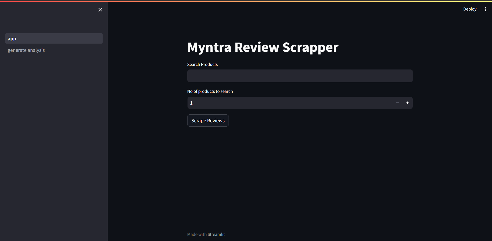
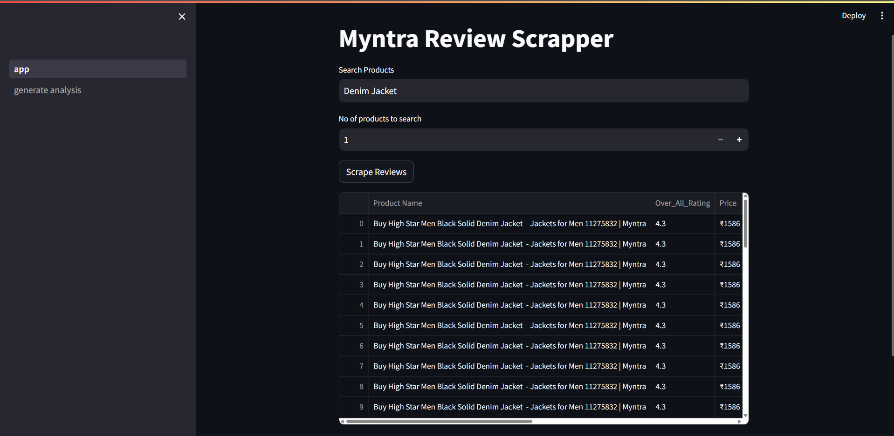
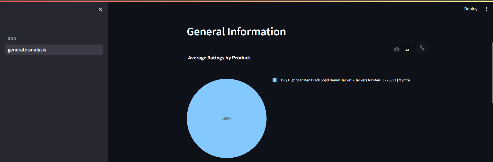
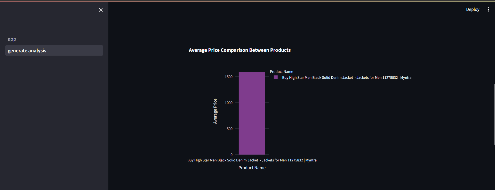
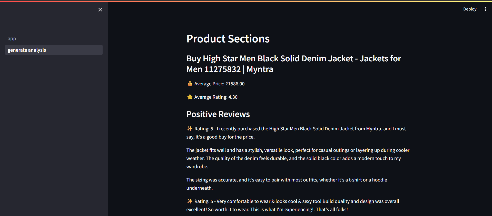
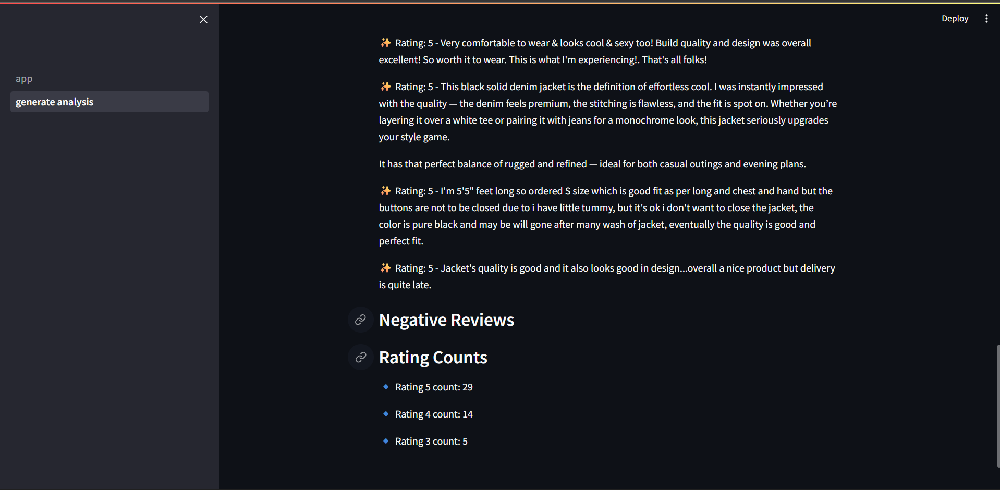
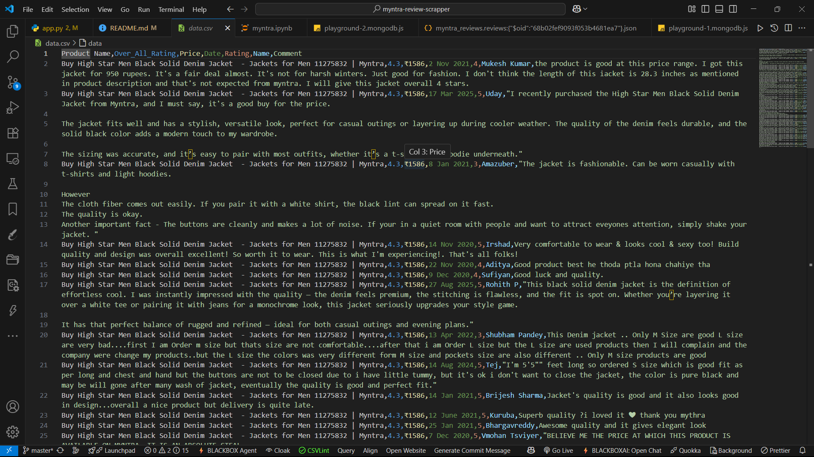
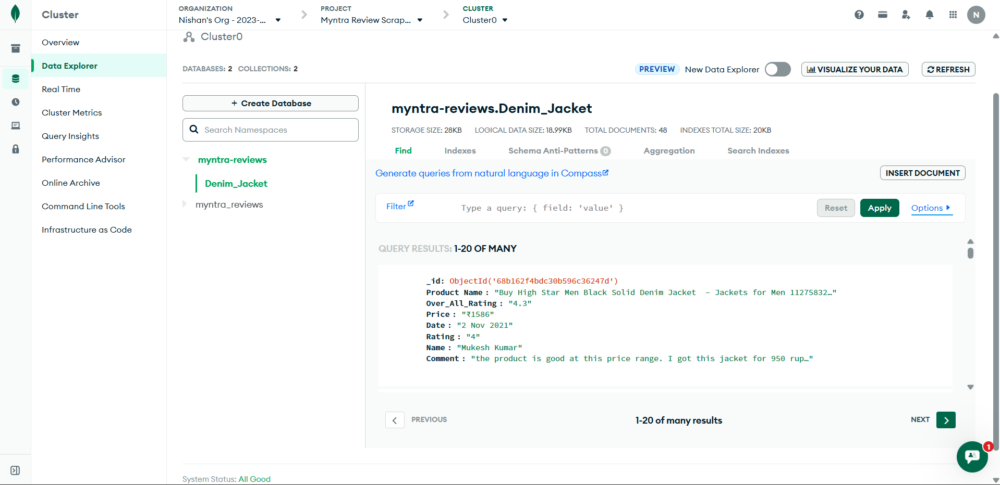

# Myntra Review Scraper 🛍️📊

A comprehensive web scraping and data analysis application that extracts, stores, and visualizes customer reviews from Myntra products. Built with Python, Selenium, Streamlit, and MongoDB for robust data collection and analysis.


## 🚀 Key Features

### 1. **Intelligent Web Scraping Engine**

- **Automated Product Discovery**: Searches Myntra for products using natural language queries
- **Smart Review Extraction**: Scrapes detailed customer reviews including ratings, comments, dates, and user information
- **Dynamic Content Loading**: Implements intelligent scrolling to load all reviews, even for products with extensive feedback
- **Error Handling**: Robust exception handling with custom error classes for reliable scraping operations

### 2. **Cloud-Native Data Storage**

- **MongoDB Integration**: Seamless connection to MongoDB Atlas for scalable data storage
- **Dynamic Collection Management**: Creates collections based on product names for organized data storage
- **Bulk Insert Operations**: Efficient data insertion with optimized MongoDB operations
- **Environment-Based Configuration**: Secure connection management using environment variables

### 3. **Interactive Data Visualization Dashboard**

- **Real-time Analytics**: Live data visualization using Plotly for interactive charts and graphs
- **Product Comparison**: Side-by-side comparison of multiple products with average ratings and prices
- **Sentiment Analysis**: Automatic categorization of positive and negative reviews
- **Rating Distribution**: Visual representation of rating patterns across products

### 4. **User-Friendly Web Interface**

- **Streamlit Web App**: Modern, responsive web interface for easy interaction
- **Product Search**: Simple text input for searching any Myntra product
- **Customizable Scraping**: Control over number of products to scrape and analyze
- **Real-time Results**: Immediate display of scraped data and visualizations

## 📸 Application Screenshots

### Web Interface

 _Streamlit-based web interface for product search and scraping_

### Data Visualization

 _Interactive charts showing product ratings and price comparisons_

 _Detailed rating distribution and sentiment analysis across products_

 _Price comparison and review volume visualization between products_

 _Customer review trends and temporal analysis patterns_

 _Comprehensive product performance dashboard with key metrics_

### Review Data

 _Detailed customer reviews with ratings and sentiment analysis_

### MongoDB Storage

 _MongoDB collections storing scraped review data_

_Note: Add your actual screenshots to the `screenshots/` folder and update the file names accordingly_

## 📊 Sample Output & Visualizations

The application generates comprehensive analytics including:

- **Average Ratings by Product** (Pie Charts)
- **Price Comparison Between Products** (Bar Charts)
- **Rating Distribution Analysis**
- **Top Positive & Negative Reviews**
- **Detailed Review Data Tables**

## 🛠️ Technology Stack

- **Backend**: Python 3.10+
- **Web Framework**: Streamlit, Flask
- **Web Scraping**: Selenium, BeautifulSoup4
- **Database**: MongoDB with database-connect package
- **Data Visualization**: Plotly, Pandas
- **Browser Automation**: ChromeDriver Binary
- **Environment Management**: python-dotenv

## 📦 Installation & Setup

### Prerequisites

- Python 3.10 or higher
- MongoDB Atlas account (or local MongoDB instance)
- Chrome browser installed

### Quick Start

1. **Clone the repository**

   ```bash
   git clone https://github.com/MeMrBerlin/Myntra-Review-Scraper.git
   cd myntra-review-scrapper
   ```

2. **Create and activate virtual environment**

   ```bash
   python -m venv myntra_env
   myntra_env\Scripts\activate
   ```

3. **Install dependencies**

   ```bash
   pip install -r requirements.txt
   ```

4. **Configure environment variables**
   Create a `.env` file with your MongoDB connection string:

   ```
   MONGODB_URL_KEY=your_mongodb_connection_string
   ```

5. **Run the application**

   ```bash
   streamlit run app.py
   ```

6. **Access the application**
   Open your browser and navigate to `http://localhost:8501`

## 🎯 Usage

1. **Search Products**: Enter any product name (e.g., "Nike shoes", "Levis jeans")
2. **Set Quantity**: Specify how many products to scrape (1-10 recommended)
3. **Initiate Scraping**: Click "Scrape Reviews" to start the process
4. **View Results**: Explore the interactive dashboard with charts and analysis
5. **Export Data**: All data is automatically saved to MongoDB and CSV files

## 🔧 Project Structure

```
myntra-review-scrapper/
├── src/
│   ├── scrapper/          # Web scraping logic
│   ├── cloud_io/          # MongoDB operations
│   ├── data_report/       # Visualization and analytics
│   ├── utils/            # Utility functions
│   └── constants/        # Configuration constants
├── templates/            # HTML templates
├── static/              # CSS and static assets
├── app.py               # Main Streamlit application
├── requirements.txt     # Dependencies
└── README.md           # Project documentation
```

## 🌟 Technical Highlights

- **Object-Oriented Design**: Clean, modular architecture with proper class structures
- **Exception Handling**: Comprehensive error handling with custom exception classes
- **Configuration Management**: Environment-based configuration for different deployment scenarios
- **Data Validation**: Type hints and data validation throughout the codebase
- **Performance Optimization**: Efficient scraping with proper waiting mechanisms and resource management

## 📈 Business Value

This tool provides valuable insights for:

- **E-commerce Analytics**: Understand customer sentiment and product performance
- **Competitive Analysis**: Compare products and pricing strategies
- **Market Research**: Gather real customer feedback for product development
- **Data-Driven Decisions**: Make informed business decisions based on customer reviews

## 🤝 Contributing

Contributions are welcome! Please feel free to submit a Pull Request. For major changes, please open an issue first to discuss what you would like to change.

## 📄 License

This project is licensed under the MIT License - see the LICENSE file for details.

## 🎓 Learning Outcomes

Through building this project, I demonstrated proficiency in:

- Web scraping and automation with Selenium
- Database management with MongoDB
- Data visualization with Plotly and Streamlit
- Software architecture and design patterns
- Error handling and logging
- Environment configuration and deployment

---

**Built with ❤️ using Python, Selenium, and Streamlit**

_Note: This project is for educational purposes only. Please ensure compliance with Myntra's terms of service when using this tool._
